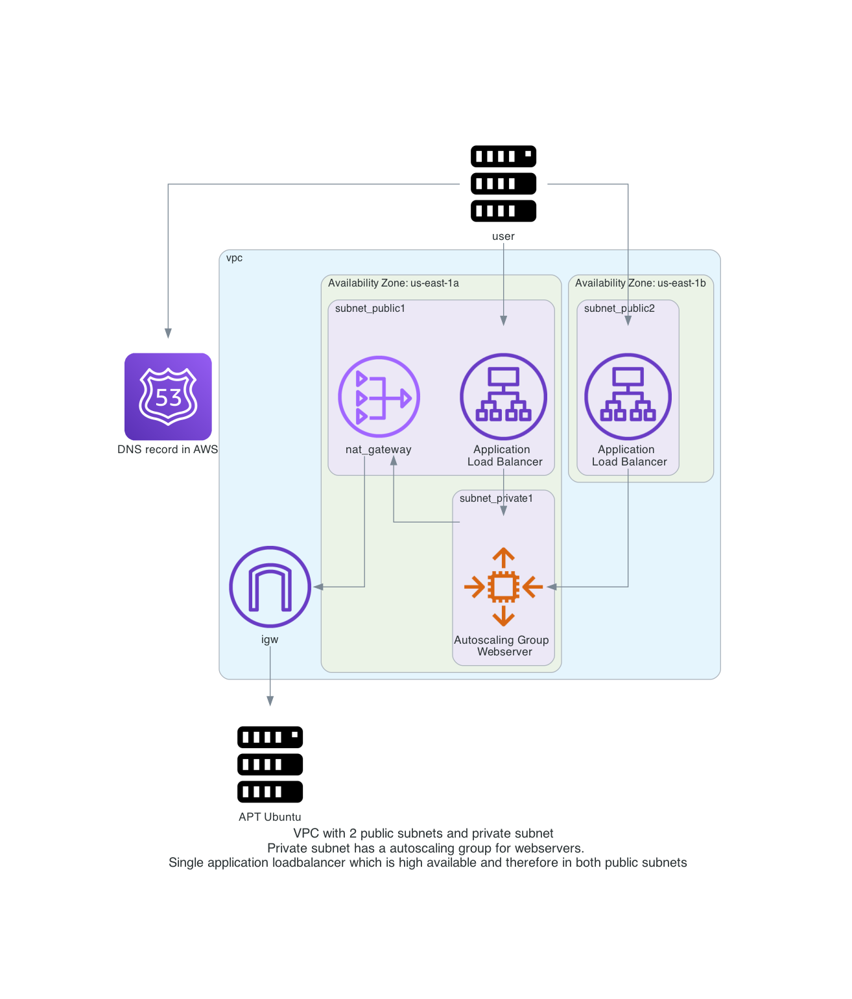

# aws_https_asg_nginx
asg with https load balancer

Detailed diagram:  
    

# done

# to do
- [ ] create VPC
- [ ] create 3 subnets, one for public network, one for private network
- [ ] create internet gw and connect to public network with a route table
- [ ] create nat gateway, and connect to private network with a route table
- [ ] route table association with the subnets 
- [ ] security group for allowing port 443 80
- [ ] Auto scaling launch configuration
- [ ] Auto scaling group creating
- [ ] import TLS certificate
- [ ] create a LB (check Application Load Balancer or Network Load Balancer)
- [ ] publish a service over LB, ie nginx
- [ ] create DNS CNAME for website to loadbalancer DNS
- [ ] Generate certificates with Let's Encrypt to use
